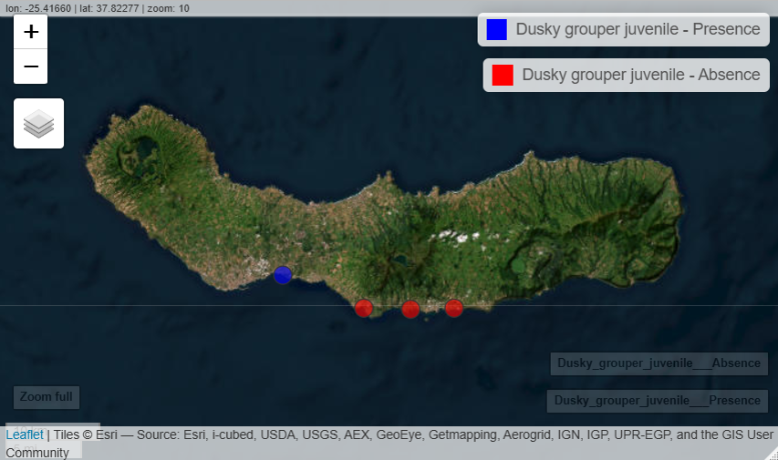
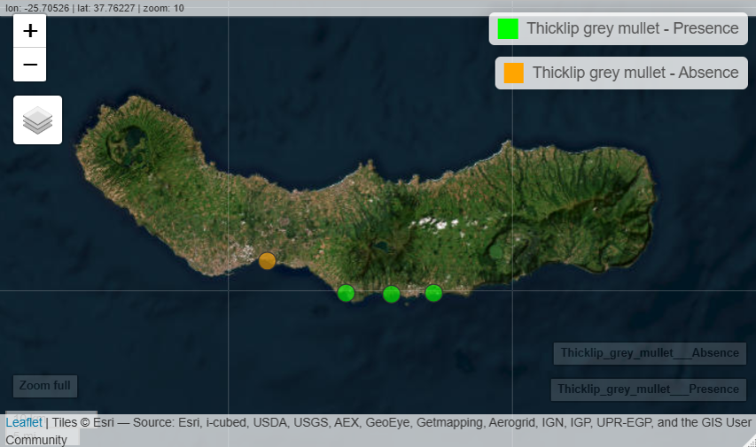
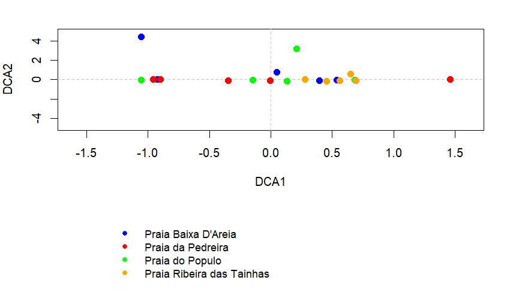
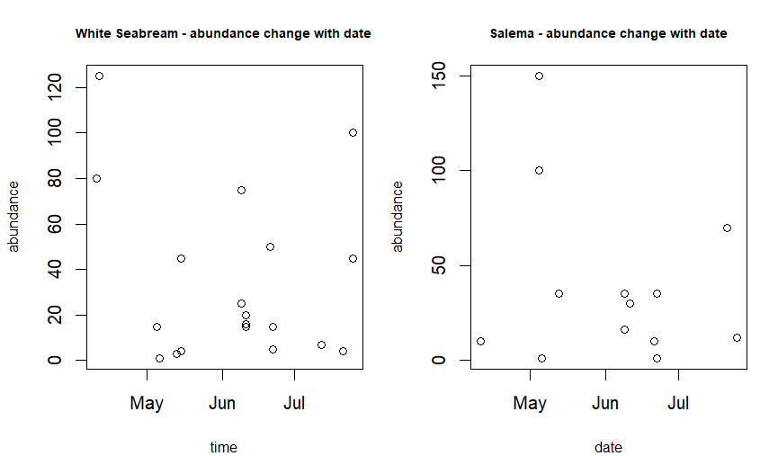
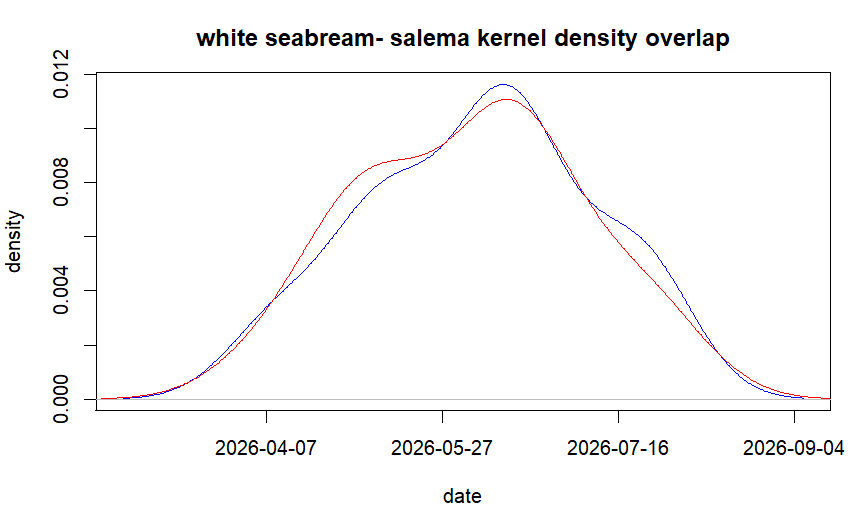
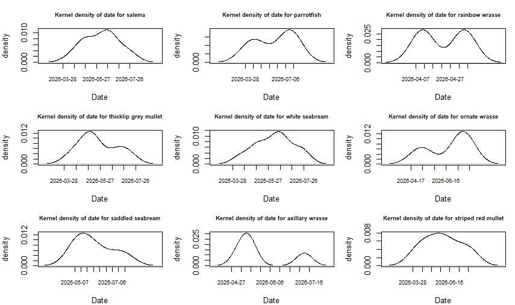
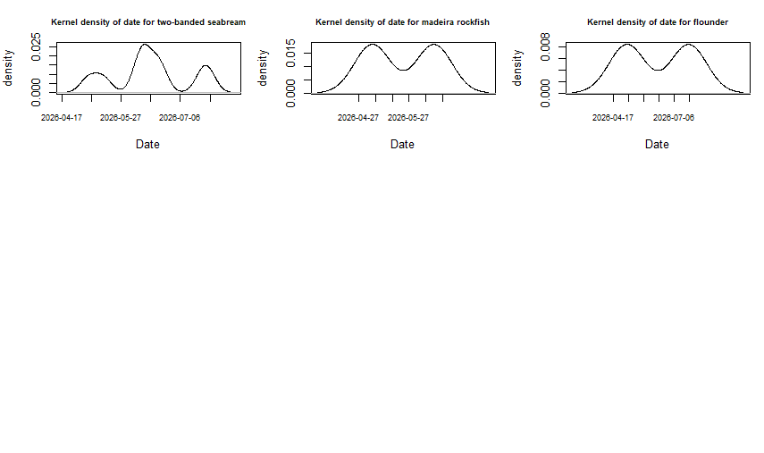
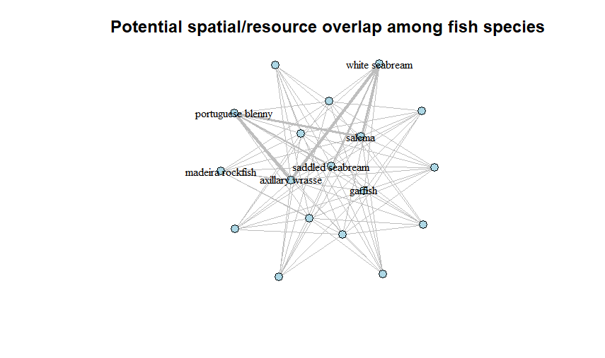

## language and working directory setup
```md
Sys.setlocale("LC_TIME", "C")
setwd("C:/Users/froio/OneDrive/Desktop/GCE &SDG/R project")
```
## packages upload
```md
library("tidyverse")
library("lubridate")
library("vegan")
library(dplyr)
library(ggplot2)
library(mapview)
library(overlap)
library(igraph)
library(terra)
```
## file upload
```md
fish <- read.csv2("C:/Users/froio/OneDrive/Desktop/GCE &SDG/R project/sao miguel fish species.csv", fileEncoding = "Windows-1252")
```
## data check
```md
glimpse(fish)
```
## data correction
```md
fish[fish == ""] <- NA
# [] selects elements inside fish dataframe and we say that where fish value is an empty string it should be a missing value.

fish<- fish|> fill(site, date, visibility.m, tide, water.T..C, wave.height.m, wave.period.s, wave.power.kW.m, wind.km.h, level, time)
# we update the fish dataframe using the fill() function from the tidyr package. The fill() function replaces missing values (NA) with the previous available value in the column.

fish$date<-dmy(fish$date)
# dmy() lubridate function which transforms a date into an R object (day-month-year)

fish$abundances<-as.numeric(fish$abundances)
fish$size.cm<-as.numeric(fish$size.cm)
fish$visibility.m<-as.numeric(fish$visibility.m)
fish$water.T..C<-as.numeric(fish$water.T..C)
fish$wave.height.m<-as.numeric(fish$wave.height.m)
fish$wave.power.kW.m<-as.numeric(fish$wave.power.kW.m)
fish$wave.period.s<-as.numeric(fish$wave.period.s)
fish$wind.km.h<-as.numeric(fish$wind.km.h)
# as.numeric basic function of R that transforms values into numbers

fish$time <- hm(fish$time)
# hm() lubridate package function that converts time in a format that R understands
```
### 1. STUDY OF SPECIES RICHNESS
```md
sc_richness <- fish |>
  summarise(species_richness = n_distinct(fish.species))
#I could also just write
sc_richness <- summarise(fish, species_richness = n_distinct(fish.species))

# this code tells R to summarise the dataset fish, detect all the different values in the column fish.species and create a column called species_richness and then put everything inside an object called sc_richness. all dplyr functions

sc_richness

## table with species names
names_sc_richness <- fish |>
  distinct(fish.species) |>
  arrange(fish.species)

# distinc() is to distinguish the different species based on the name and arrange() puts them in alphabetical order. they're all dplyr functions

#or I could also write
names_sc_richness <- arrange(
  distinct(fish, fish.species),
  fish.species
)

names_sc_richness

knitr::kable(names_sc_richness)
```
|  | fish species|  | fish species|
|---:|---|---:|---|
| 1 |axillary wrasse        | 10 |portuguese blenny      |
| 2 |pufferfish             | 11 |blue damselfish        |
| 3 |rainbow wrasse         | 12 |bogue                  | 
| 4 |saddled seabream       | 13 |dusky grouper juvenile |
| 5 |salema                 | 14 |flounder               |
| 6 |striped red mullet     | 15 |garfish                |
| 7 |thicklip grey mullet   | 16 |madeira rockfish       |
| 8 |two-banded seabream    | 17 |ornate wrasse          |
|9 9|white seabream         | 18 |parrotfish             |

### 2. STUDY OF MEAN ABUNDANCE OF EACH SPECIES
```md
mean_abundance_overall <- fish |>
  group_by(fish.species) |>
  summarise(mean_abundance = mean(abundances, na.rm = TRUE),
    .groups = "drop") |>
  arrange(desc(mean_abundance))

# group_by() is a dplyr function that creates a groups the data based on the species, then summarise() is a dplyr function that creates a result containing mean_abundance which is the mean value of all abundances for each species and then arrange() (dplyr function) orders the result from species with highest to lowest abundance. (MAYBE NA.RM = TRUE COULD BE REMOVED)

mean_abundance_overall

knitr::kable(mean_abundance_overall)
```
|fish.species           | mean_abundance|
|:----------------------|--------------:|
|salema                 |      38.8|
|white seabream         |      34.2|
|bogue                  |      20|
|two-banded seabream    |       6.1|
|rainbow wrasse         |       3|
|thicklip grey mullet   |       3|
|parrotfish             |       2.7|
|dusky grouper juvenile |       2|
|saddled seabream       |       2|
|striped red mullet     |       1|
|ornate wrasse          |       1.3|
|axillary wrasse        |       1|
|blue damselfish        |       1|
|flounder               |       1|
|garfish                |       1|
|madeira rockfish       |       1|
|portuguese blenny      |       1|
|pufferfish             |       1|

## Mean abundance heatmap
```md
ggplot(mean_abundance_overall,
    aes(x = "abundance",y = reorder(fish.species, mean_abundance),
# y=rorder... is a basic R function that puts species on the y axis and orders them based on their mean abundance
    fill = mean_abundance))
# fill means that the color of the tile depends on the mean abundance (and creates the gradient on the side)
 +
geom_tile(color = "white")
# geom_tile creates rectangular tiles with a white line between them COULD AVOID IT
+
# geom_text writes the text on the graph. aes is aesthetic mappings and controls which variables are used to create the graph. color and size are fixed settings so they are not part of aes
geom_text(
    aes(label = round(mean_abundance, 2)),
# round (mean...) is a basic R function that rounds to 2 decimals, could be label=mean_abundance
    color = "black",
    size = 3.5) +
scale_fill_gradient(low = "yellow", high = "orange")
# scale_fill-gradient is a ggplot2 function that assigns a color to low and high values +
labs(
  x = NULL,
  y = "Species",
  fill = "Mean abundance gradient",
  title = "Mean abundance of fish species")
# labs is a ggplot2 function used for setting labels and heads of graphs. x:null means no label for x axis, fill: is the head of legend for color gradient
+
theme_minimal()
# minimalist style
+
theme(
  axis.text.x = element_text(face = "bold"),
  axis.text.y = element_text(size = 9),
  plot.title = element_text(face = "bold", hjust=0.5))
# to adjust the aesthetic of the graph, like bold letters, size and centered text--> hjust=0.5
```


## 3. STUDY OF ENDANGERED (Dusky Grouper) AND NEAR THREATENED (Thicklip Grey Mullet) SPECIES DISTRIBUTION
```md
#adding sites coordinates
coordinates <- data.frame(
  site = c(
    "Praia da Pedreira",
    "Praia Ribeira das Tainhas",
    "Praia Baixa D'Areia",
    "Praia do Populo"),
  latitude = c(
    37.7154764,
    37.7159691,
    37.7165400,
    37.7484241),
  longitude = c(
    -25.4627892,
    -25.4096397,
    -25.5179964,
    -25.6157604))
# all basic R functions. we create a data frame so we can have an organized table with associations already made and it will be easier to merge it with the fish data frame. c() creates a vector of values. latitude and longitude values are taken from google earth. 

#combining dataset and coordinates
fish <- merge(fish, coordinates, by = "site")
# merge() is a basic R function that puts together the 2 dataframes fish and coordinates using the common column "site", meaning that now in fish dataframe we will also have the coordinates associated to the sites.

#check names
names(fish)
# basic R function used to check the names of the column because now the coordinates could have a different name. .x and .y doesn't mean latitude or longitude, it's just a random letter used to change the name.

#transforming the dataset into a Spatvector
fish_vect <- vect(
  fish,
  geom = c("longitude.y", "latitude.x"),
  crs = "EPSG:4326")
# vect() is a terra function that transforms the dataframe fish into a SpatVector, which is still a dataframe but with spatial characteristics.
# geom() is an argument of vect (to check I could do args(vect)), it stands for geometry and is used to tell vect() which columns to use as coordinates
# crs is another vect() argument which specifies the geographic reference system. it corresponds to WGS 84 coordinates (World Geodetic System 1984), used to express a location on earth in latitude and longitude. I know that i have to use "EPSG:4326" because it is the code associated for WGS 84 and google earth uses this kind.

#extracting the 4 sites
sites <- fish_vect[!duplicated(fish_vect$site), ]
# the syntax [] is a basic R object that allows to select certains values.
# duplicated() is also a basic R function that finds duplicated values. by putting ! in front which means not we are choosing only non duplicated values
#I DIDN'T USE UNIQUE() BECAUSE THIS FUNCTION GIVES BACK DIRECTLY THE VALUES WITHOUT DUPLICATES, SO JUST THE SINGLE SITE NAMES. DUPLICATED() INSTEAD WORKS BETTER WITH ROWS AND ALLOWS ME TO KEEP ALL THE INFO ASSOCIATED TO THE ROW.
# $site selects the column site
# the ored is [rows, columns] so we choose which rows we want but we keep columns "empty" so that we keep all columns associated to those rows (like the coordinates)

#choosing 1st species
EN_sites <- unique(
  fish_vect$site[fish_vect$fish.species == "dusky grouper juvenile "])
# i am creating just a vector with the names of the sites where I recored the species so I can use the basic function of R unique() which gives me the different names jsut 1 time
# inside unique I put only the column site of the spatvector fish_vect
# and I select only the data related to the species I want in the column fish.species of the spatvector fish_vect

#if I wanted to create directly a spatial object I could have used:
EN_sites <- fish_vect[
  fish_vect$fish.species == "dusky grouper juvenile " &
  !duplicated(fish_vect$site),
]

sites$Occurrence_EN <- 0
sites$Occurrence_EN[sites$site %in% EN_sites$site] <- 1

#choosing 2nd species
NT_sites <- unique(
  fish_vect$site[fish_vect$fish.species == "thicklip grey mullet"])

#creating the occurrence 1st species
sites$Occurrence_EN <- 0
sites$Occurrence_EN[
  sites$site %in% EN_sites
] <- 1
# I am assigning a 0 or 1 value to certain elements of a column
# I am creating the column Occurrence_EN and first everything has value 0
# then in that column I select all the objects associates to the column sites and if they appear in the vector EN_sites as well then the value is 1. %in% is an R operator that tells if a value is part of a group of values

#check
sites$Occurrence_EN

#creating the occurrence 2nd species
sites$Occurrence_NT <- 0
sites$Occurrence_NT[
  sites$site %in% NT_sites
] <- 1
#check
sites$Occurrence_NT

# NOT NECESSARY
#data frame dusky grouper/thicklip grey mullet occurrence
EN_occurrence_df <- as.data.frame(sites$Occurrence_EN)
NT_occurrence_df <- as.data.frame(sites$Occurrence_NT)
# NOT NECESSARY

#presence and absence duskygrouper
pres_EN <- sites[sites$Occurrence_EN == 1,]
abse_EN <- sites[sites$Occurrence_EN == 0,]

# selecting only values 1 for presence and values 0 for absence in sites spatvector

#presence and absence thicklip grey mullet
pres_NT <- sites[sites$Occurrence_NT == 1,]
abse_NT <- sites[sites$Occurrence_NT == 0,]
```

### Dusky Grouper (EN) presence-absence map
```md
map_EN <- mapview(
  sites[sites$Occurrence_EN == 1, c("site", "Occurrence_EN")],
  col.regions = "blue",
  cex = 8,
  layer.name = "Dusky grouper juvenile - Presence"
) +
  mapview(
    sites[sites$Occurrence_EN == 0, c("site", "Occurrence_EN") ],
    col.regions = "red",
    cex = 8,
    layer.name = "Dusky grouper juvenile - Absence"
)
# mapview() is a function of the mapview package that represents an object on a map.
# we are representing sites: the rows are the presences and absences and the columns are sites and occurrence
# col.regions is a mapview argument that assigns a color to certain point or regions on the map
# layer.name is a mapview argument that gives a name to the layer of the map

# OPPURE
mapview(
  pres_EN[, c("site", "Occurrence_EN")],
  col.regions = "blue",
  cex = 8,
  layer.name = "Dusky grouper juvenile - Presence"
)+
mapview(
  abse_EN[, c("site", "Occurrence_EN")],
  col.regions = "red",
  cex = 8,
  layer.name = "Dusky grouper juvenile - Absence"
)


map_EN
```




### Thicklip Grey Mullet (NT) presence-absence map
```md
map_NT <- mapview(
  sites[sites$Occurrence_NT == 1, c("site", "Occurrence_NT")],
  col.regions = "green",
  cex = 8,
  layer.name = "Thicklip grey mullet - Presence"
) +
  mapview(
    sites[sites$Occurrence_NT == 0, c("site", "Occurrence_NT") ],
    col.regions = "orange",
    cex = 8,
    layer.name = "Thicklip grey mullet - Absence"
)

map_NT
```


## 4. DCA on fish community among sites
```md
# exctract values from spatvector
fish_df <- values(fish_vect)
# to create a DCA is better to work with a dataframe and not a spatvector because it doesn't use spatial data. so we extract the values from fish_vect and create fish_df
# values() is a terra package function

#creating transect value
#site + date = transect
fish_df$transect <- paste(
  fish_df$site,
  fish_df$date,
  sep = "_"
)
# creating the column transect
# we use paste() (basic R function) to create a singular object with both information about site and date. If I had used c() it would have created a vector with separated info.
# I could avoid using sep = "_"


# 2d matrix
#rows = transect
#columns = species
#values = abundances

dca_matrix <- xtabs(
  abundances ~ transect + fish.species,
  data = fish_df
)
# I am creating the matrix for the DCA using the R base function xtabs(). The matrix is structured with transects as rows, fish species as columns, and their corresponding abundances as values. All the information is extracted from fish_df.

# turn NA into 0
dca_matrix[is.na(dca_matrix)] <- 0
# in some cases there might not be a value recorded for a combination of transect and species so we are using is.na() R basic function to find those missing values and turn them into 0

# dimension check
dim(dca_matrix)
# dim() basic R function that tells the number of rows and columns for the dataframe

#  DCA
dca <- decorana(dca_matrix)

#  eigenvalues: they explain how important each DCA axis is when representing the differences in fish composition among sites
dcal1 <- dca$evals[1]
dcal2 <- dca$evals[2]
dcal3 <- dca$evals[3]
dcal4 <- dca$evals[4]

total <- sum(c(dcal1, dcal2, dcal3, dcal4))

#  DCA1 and DCA2 %
percdca1 <- dcal1 * 100 / total
percdca2 <- dcal2 * 100 / total

#check
percdca1
percdca2

# % DCA1 + DCA2
percdca1 + percdca2

#to see where the transects are in the graph
transect_scores <- scores(
  dca,
  display = "sites")

transect_scores
```
### Plot
```md

#matching the transect to the site
transect_names <- unique(
  fish_df[, c("transect", "site")]
)

# Put transects in the same order as in the DCA
transect_names <- transect_names[
  match(rownames(transect_scores),transect_names$transect),]

#matching color to site
point_colors <- rep("black",nrow(transect_scores))

point_colors[transect_names$site %in% "Praia Baixa D'Areia"] <- "blue"

point_colors[transect_names$site %in% "Praia da Pedreira"] <- "red"

point_colors[transect_names$site %in% "Praia do Populo"] <- "green"

point_colors[transect_names$site %in% "Praia Ribeira das Tainhas"] <- "orange"

# check that there are 5 transects for each site
table(point_colors)

#set axis
xlim <- max(abs(transect_scores[, "DCA1"])) * 1.1

ylim <- max(abs(transect_scores[, "DCA2"])) * 1.1

#set graph and legend area
layout(matrix(c(1, 2),nrow = 2),heights = c(4, 2))

#DCA graph
par(mar = c(5, 4, 2, 2))

plot(
  transect_scores[, "DCA1"],
  transect_scores[, "DCA2"],
  type = "n",
  xlim = c(-xlim, xlim),
  ylim = c(-ylim, ylim),
  xlab = "DCA1",
  ylab = "DCA2"
)
# Lines crossing at zero
abline(
  h = 0,
  v = 0,
  col = "grey80",
  lty = 2
)
# add transects as coloured points
points(
  transect_scores[, "DCA1"],
  transect_scores[, "DCA2"],
  pch = 19,
  col = point_colors,
  cex = 1.2
)

#legend
par(
  mar = c(0, 0, 0, 0)
)

plot.new()

legend(
  "center",
  legend = c(
    "Praia Baixa D'Areia",
    "Praia da Pedreira",
    "Praia do Populo",
    "Praia Ribeira das Tainhas"
  ),
  col = c(
    "blue",
    "red",
    "green",
    "orange"
  ),
  pch = 19,
  bty = "n",
  cex = 0.9
)
```


## 5. ABUNDANCE CHANGE OVER 5 MONTHS OF THE 2 MOST ABUNDANT SPECIES
```md
#selection of species, dates and relative abundances - white seabream
white_seabream<-fish[fish$fish.species=="white seabream",]
white_seabream_date<-white_seabream$date
white_seabream_abundance<-white_seabream$abundances

#selection of dates, species and relative abundances - salema
salema<-fish[fish$fish.species=="salema",]
salema_date<-salema$date
salema_abundance<-salema$abundances
```
### plots of abundance change over 5 month in white seabream and salema
```md
par(mfrow = c(1, 2),mar = c(4, 4, 3, 1))

plot(white_seabream_date, white_seabream_abundance, xlab = "time", ylab = "abundance", main = "White Seabream - abundance change with date", cex.main = 0.7, cex.lab = 0.8)

plot(salema_date, salema_abundance, xlab = "date", ylab = "abundance", main = "Salema - abundance change with date", cex.main = 0.7, cex.lab = 0.8)

#to go back to singular plots
par(mfrow = c(1, 1))
```

## 6. DETECTION FREQUENCY ANALYSIS 
```md
# White Seabream
#transform date into numeric value
white_seabream_date_numeric<-as.numeric(white_seabream_date)
#kernel density
wsb_linear_kd<-density(white_seabream_date_numeric)

#Salema
salema_date_numeric<-as.numeric(salema_date)
#kernel density
s_linear_kd<-density(salema_date_numeric)

# comparison plot
par(mfrow=c(1,1))

plot(wsb_linear_kd,
      col = "blue",
      xaxt = "n",
      xlab = "date",
      ylab = "density",
      main = "white seabream- salema kernel density overlap")
 
lines(s_linear_kd, col = "red")
 
axis(1, at = pretty(c(wsb_linear_kd$x, s_linear_kd$x)), labels = as.Date(pretty(c(wsb_linear_kd$x, s_linear_kd$x)), origin = "1970-01-01"))
```

# Loop to check other species detection frequency
```md
fish_date_numeric <- as.numeric(fish$date)
species_list <- unique(fish$fish.species)

#plot
par(mfrow = c(3, 3))
for (species in species_list) {species_data <- fish[
    fish$fish.species == species,]
if (nrow(species_data) >= 2) { species_data$date_numeric <- as.numeric(
      species_data$date)
    linear_kd <- density(species_data$date_numeric)
    
    plot(linear_kd,
         main = paste("Kernel density of date for", species),
         xlab = "Date",
         ylab = "density",
         xaxt = "n",
         cex.main = 0.7)
    
    axis(1,
         at = pretty(species_data$date_numeric),
         labels = as.Date(pretty(species_data$date_numeric),
                          origin = "1970-01-01"), cex.axis = 0.7)}}
# Return to one plot at a time
par(mfrow = c(1, 1))
```
### linear kernel density plots other speacies recorded at least twice



## 7. COMMUNITY GRAPH TO STUDY POTENTIAL SPATIAL/RESOURCE OVERLAP DEPENDING ON FISH SIZE AND ABUNDANCE
```md
#Calculating mean size and mean abundance for each species
species_size <- fish %>%
  select(fish.species, size.cm, abundances) %>%
  group_by(fish.species) %>%
  summarise(
    mean_size = mean(size.cm, na.rm = TRUE),
    mean_abundance = mean(abundances, na.rm = TRUE)
  )

#Creating big and small species categories based on mean size 
big_species <- species_size %>%
  filter(mean_size > 15) %>%
  pull(fish.species)

small_species <- species_size %>%
  filter(mean_size <= 15) %>%
  pull(fish.species)

 #Creating interactions between big and small species 
 interactions <- expand.grid(
  big_species = big_species,
  small_species = small_species
)
#Adding the mean size of the species
interactions_big_size <- species_size$mean_size[match(interactions$big_species, species_size$fish.species)]

interactions_small_size <- species_size$mean_size[match(interactions$small_species, species_size$fish.species)]

#Calculating size difference
interactions_size_difference <- abs(interactions_big_size - interactions_small_size)

#Potential spatial/resource overlap
#Smaller size difference = higher potential overlap
interactions$overlap <- 1 / (1 + interactions_size_difference)

# graph all size + all interactions
interactions_graph <- graph_from_data_frame(
  interactions[
    ,
    c(
      "big_species",
      "small_species",
      "overlap"
    )
  ],
  vertices = species_size$fish.species,
  directed = FALSE
)
#nodes size
V(interactions_graph)$size <- 8

#edge thickness base on overlap
E(interactions_graph)$width <-
  E(interactions_graph)$overlap * 8

#selection of strongest interactions
strong_interactions <- interactions %>%
  arrange(desc(overlap)) %>%
  slice_head(n = 10)
#species involved in strongest interactions
label_species <- unique(
  c(
    strong_interactions$big_species,
    strong_interactions$small_species
  )
)
#show labels
V(interactions_graph)$label <- ifelse(
  V(interactions_graph)$name %in% label_species,
  V(interactions_graph)$name,
  ""
)

# plot
plot(
  interactions_graph,
  vertex.color = "lightblue",
  vertex.size = 8,
  vertex.label = V(interactions_graph)$label,
  vertex.label.cex = 0.8,
  vertex.label.color = "black",
  edge.color = "grey",
  edge.width = E(interactions_graph)$width,
  main = "Potential spatial/resource overlap among fish species"
)
```
### community interactions based on fish size plot


